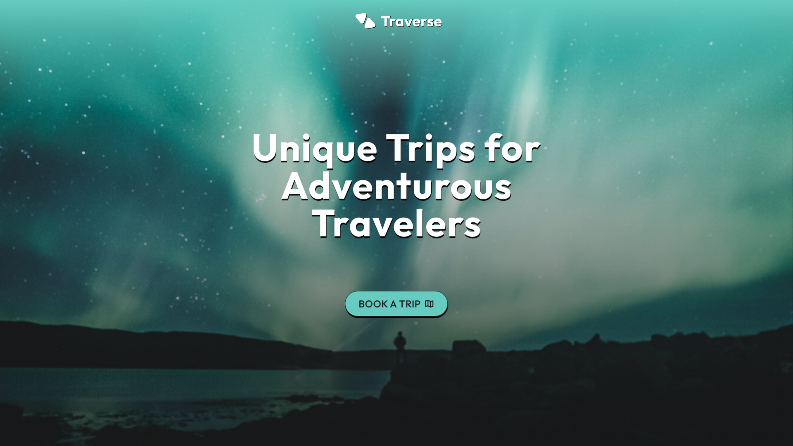

# Traverse Landing Page

Welcome to the Traverse Landing Page! This project is a sleek and modern web experience designed for adventurous travelers, showcasing unique trips to exotic locations. It features a responsive design, custom styling with Tailwind CSS v4, and interactive elements to provide an engaging user interface.

---

## 🛠️ Tech Stack

* **HTML5:** For semantic structure.
* **Tailwind CSS v4 (Alpha):** For utility-first styling and a highly customizable design system.
* **JavaScript (Vanilla JS):** For interactive elements and dynamic behavior.

---

## ✨ Features

* **Responsive Design:** Optimized for seamless viewing across all devices (mobile, tablet, desktop).
* **Custom Tailwind CSS v4 Theme:** Includes custom colors, typography, spacing, and drop shadows defined directly in CSS.
* **Parallax Scrolling Effect:** Creates a sense of depth and immersion as users scroll through the hero section.
* **Image Slider:** An interactive slider showcasing stunning travel destinations.
* **Smooth Scroll Animations:** Elements fade and slide into view for a polished user experience.

---

## 📸 Live Project & Website Screenshot

Explore the live project here: [https://traverseparallax.netlify.app/](https://traverseparallax.netlify.app/)

---
